Привет, меня зовут **Алина** 👋

Учусь на курсе  

**Fullstack разработчик на Python**
 

Блок **Frontend-разработка**
# [Онлайн чат](http://127.0.0.1:8000/core/)


[](https://git.io/typing-svg)

---
**Задание:**

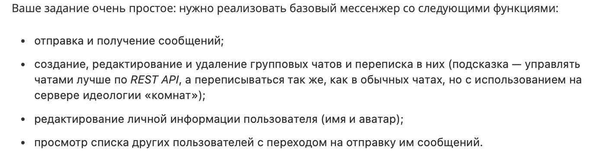

**Оценки:**

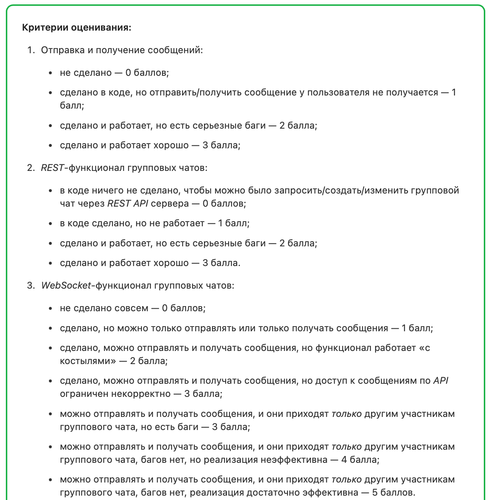
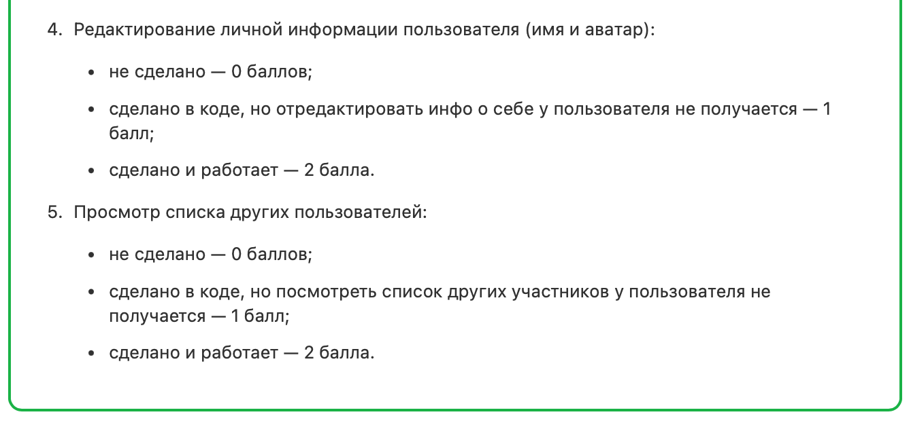

**Для запуска проекта необходимо:**

1. Клонировать репозиторий 

    ➡️  [Github repository](https://github.com/Nimalia/E6-SF-onChat.git)

2. Установить виртуальное окружение
    ```bash 
    python3 -m venv venv
    ```

    ```bash 
    source ./venv/bin/activate
    ```
3. Установить `requirements.txt`
    ```bash 
    pip install -r requirements.txt
    ```
4. Создать пользователя
    ```bash 
    python3 manage.py createsuperuser
    ```
5. Запустить сервер
    ```bash 
    python3 manage.py runserver
    ```

**Проект:**


### **Структура сайта:**

1. Для незарегистрированных пользователей главная страница выглядит так:
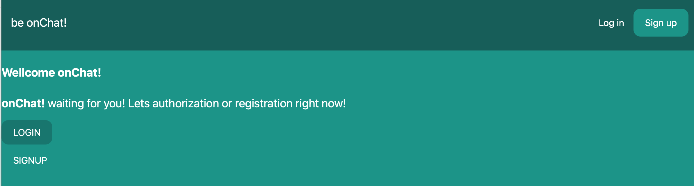

2. Чтобы польваться всем функционалом необходимо зарегистрироваться и войти 
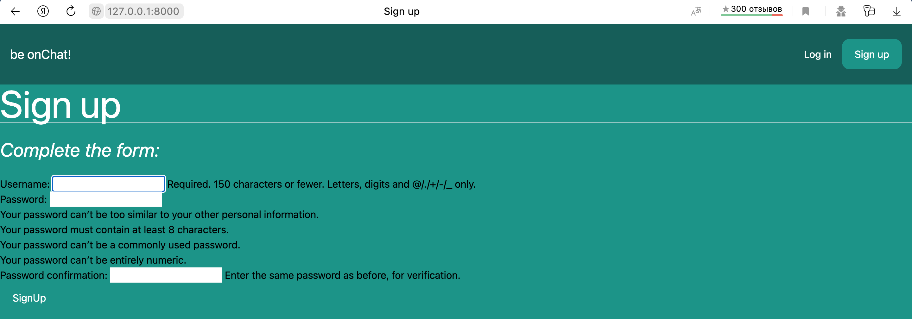
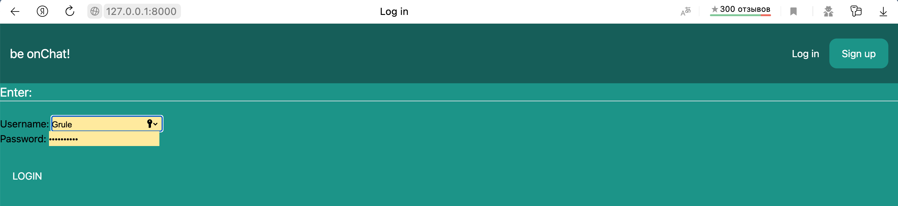

3. Для зарегистрированных пользователей главная страница выглядит так:
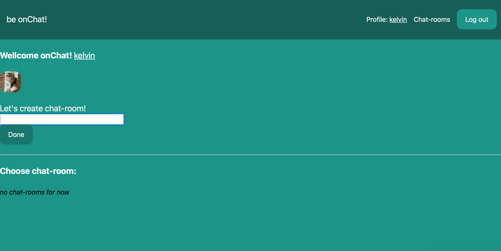   

4. Доступен функционал по редактированию профиля. Также на странице профиля можно установить персональный аватар
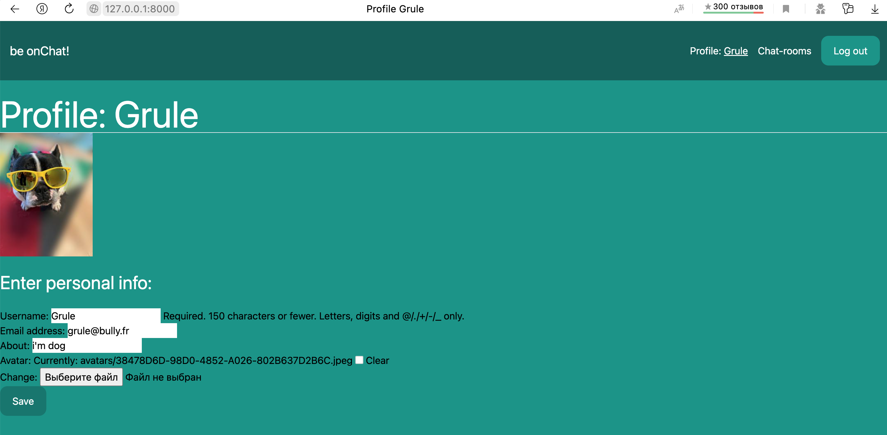 
5. Чат реализован следующим образом:
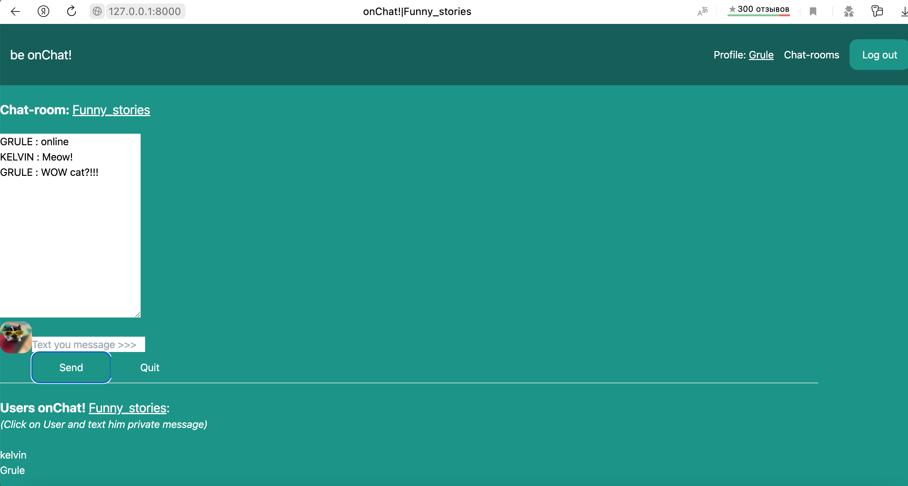 
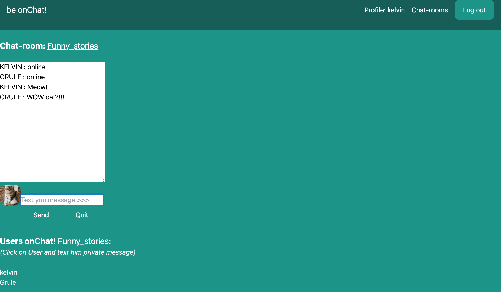 
На странице чата расположен список пользователей,которые находятся в текущей чат-комнате.
6. Реализована возможность отправлять приватные сообщения другому пользователю
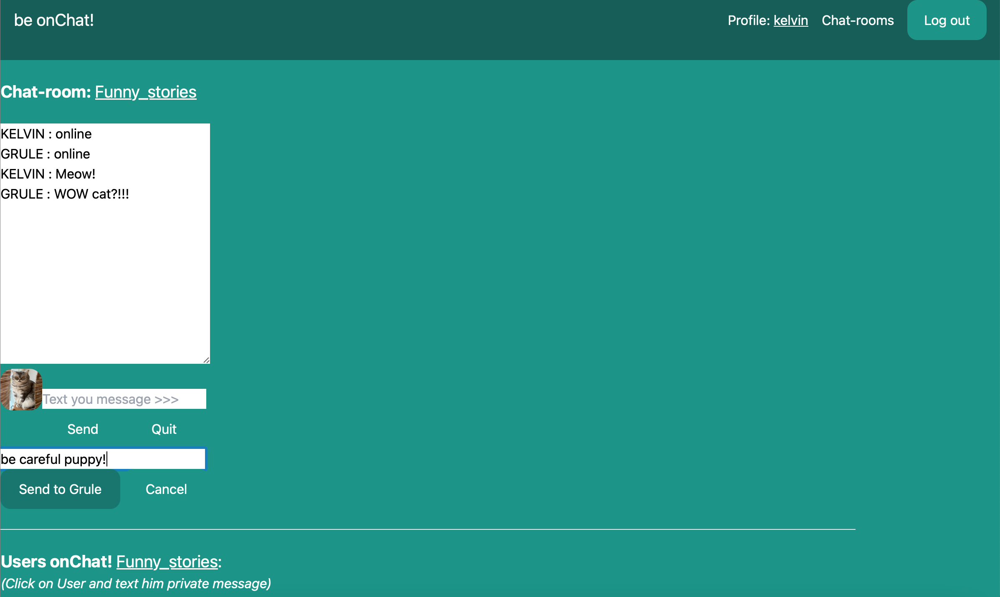 
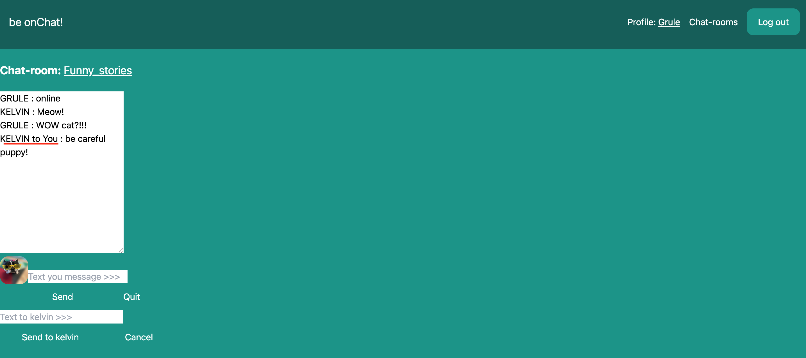 


----
```` Спасибо за уделенное время! 🙏 ````

___


[](https://github.com/anuraghazra/github-readme-stats)